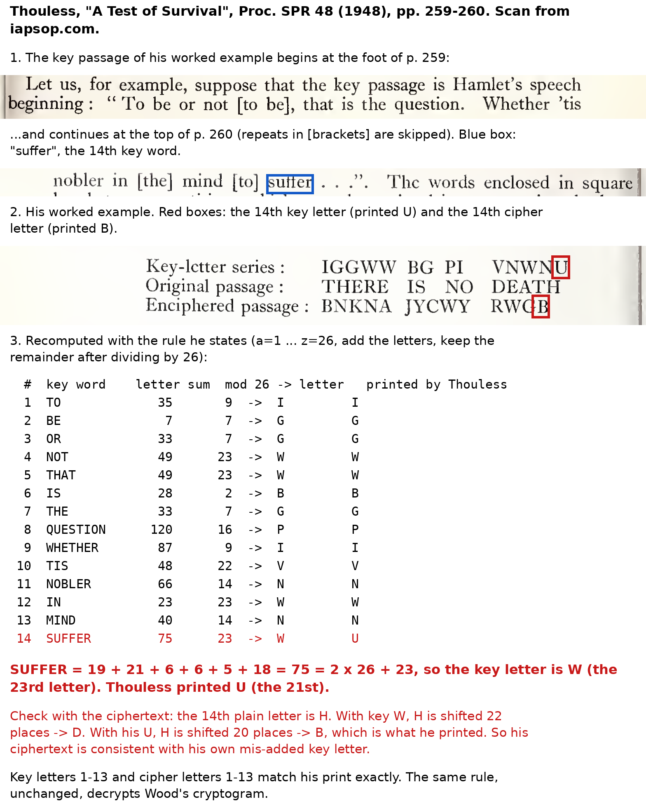

# T. E. Wood's 1950 cryptogram, solved

In 1950 T. E. Wood published a 21-letter cryptogram in the *Proceedings of the Society for
Psychical Research*. It was a test of survival after death: he would die, then try to send the
key back through a medium. No key ever came, and the cryptogram stayed unsolved for 76 years.
It is #35 on Klaus Schmeh's list of the Top 50 unsolved encrypted messages.

This repository holds the solution, the code that found it, and the checks. **Klaus Schmeh
confirmed the solution on 4 October 2026.**

| | |
|---|---|
| Ciphertext | `FVAMI NTKFX XWATB OIZVV X` |
| Key passage | The Lord's Prayer in German, 1912 Luther Bible text, from "Unser Vater in dem Himmel" (Matthew 6:9b-11) |
| Method | Robert Thouless's 1948 word-sum system, which Wood said he used |
| Plaintext | `HIERBINICHTOTSIENSTEW` |
| Reading | "Hier bin ich. Totsiens. T.E.W." German for "here I am", Afrikaans for "goodbye", and Wood's initials |

## Check it yourself

```
python3 harness/wood35t/verify_wood.py
```

Python 3.6 or later, standard library only. The script builds the key from the prayer text,
decrypts all 21 letters, re-encrypts them to Wood's exact ciphertext, and shows that near misses
(the modern church wording, keeping repeated words, dropping the off-by-one) give junk.

## The method in brief

Take the key passage word by word, skipping any word already used. Add up each word's letters
(A=1 to Z=26) and keep the remainder after dividing by 26; that number picks a key letter
(1 is A, 25 is Y, 0 is Z). Shift one message letter by that key letter through a Vigenère
square, where A means no shift. Twenty-one distinct words make 21 letters.

For example, UNSER = 21+14+19+5+18 = 77, which leaves 25, so the key letter is Y, a shift of 24.
The first cipher letter F goes back 24 places to H.

## How it was found

1. **The old dismissal was wrong.** Twenty-one letters was long thought too short to solve,
   because Thouless's system can turn any ciphertext into any plaintext with some key. But Wood's
   key is consecutive words of a published book, so the possible keys are just the starting points
   in real books. That can be searched. `harness/wood35/` (Round 52, September 2026) showed that
   a planted message is recovered at rank 1 in 97 of 100 tests over 28.6 million starting points.
2. **English-only searches came back empty**, first over 129 books, then over 3,848 Project
   Gutenberg books in 14 languages.
3. **Wood had said the message "will not be in any one language".** An English-only scorer
   would throw the right answer away. `harness/wood35t/` scores candidates as words from several
   languages at once, and adds 19 Bibles, since Wood said the key was in "an accessible book" in a
   foreign language.
4. **The Bible run's top result** came from the German Bible at the start of the Lord's Prayer.
   The runner-up was junk.

The search rules were committed before Wood's ciphertext was scored (`harness/wood35t/PREREG.md`).
The result fell short of the automatic pass mark set there, because the scorer had no Afrikaans
and no notion of initials. Reading it settled the question. The full account, including that
shortfall, is in `attempts/wood35_solve_2026-10-04/REPORT.md`.

## Checks

- An independent review by OpenAI's GPT-6 Astra (`notes/astra/REVIEW_WOOD35.md`), which also
  reimplemented the decryption and matched it letter for letter.
- The original 1948 and 1950 papers (`research/incoming/wood35_primary/SOURCES.md`).
- A luck test: 854 million decryptions across all the texts with 500 random "signatures" in place
  of TEW. Random signatures got a words-then-signature hit about 1.4% of the time, always word
  salad; TEW got exactly one, this one (`harness/wood35t/lookelsewhere.py`, `tew_hits.py`).

## A slip in Thouless's own example

Thouless's 1948 worked example mis-adds one word. "Suffer" is 75, which gives W, but he printed U,
and his ciphertext follows the mistake: the last letter should be D, not B. See
`research/incoming/wood35_primary/thouless_1948_suffer_slip.png`.



## Running the searches

The standalone verifier needs only Python's standard library. The historical searches also need
NumPy and Numba, plus external corpora and model-building inputs that are not included here:
`harness/wood35/fetch_books.py` downloads the Gutenberg books (it expects a Gutenberg catalogue
CSV), `harness/wood35t/bible_shards.py` converts locally downloaded Bible XML files
([christos-c/bible-corpus](https://github.com/christos-c/bible-corpus)) into shards, and the
English n-gram tables used by `harness/ngrams.py` are built from a local corpus.
`harness/wood35t/chance_sim.py` also needs SciPy. Scripts keep working data in `.cache/wood35/`;
run them from the repository root. To run
`harness/verify_thouless_b.py`, save Project Gutenberg book 41215 (Thompson's *The Hound of
Heaven*) as `harness/data/keytexts/41215.txt`.

## About this repository

These files were extracted, with their commit history, from a larger working repository.
Commit dates are the originals and messages are lightly edited; commit IDs are new. A few
documents mention files from that repository that are not included here.

## Credits

Robert Thouless designed the method, and Richard Bean's 2019 solution of Thouless's own
Message B showed exactly how it works. Klaus Schmeh kept the puzzle in view and confirmed the
answer. Claude (Anthropic) wrote the search code and found the key; GPT-6 Astra (OpenAI)
reviewed it independently.

## License

The code is under the MIT License (see `LICENSE`). The quotations and page images from the 1948
and 1950 *Proceedings of the Society for Psychical Research* are short extracts included for
commentary, and are not covered by that license. Nor are the third-party texts and data: the
key-text passages in `harness/wood35t/passages/`, the word lists behind `mlseg_lex.pkl` and
`pooled_4.npy`, and the Bible and Gutenberg texts the searches download.
